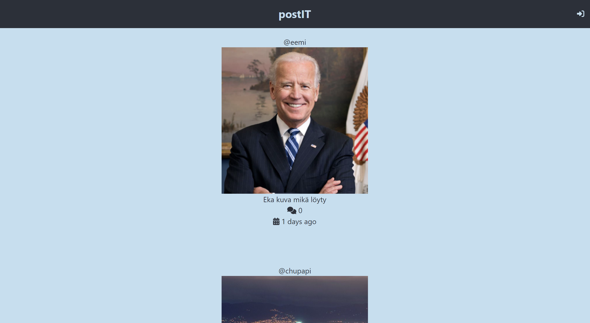
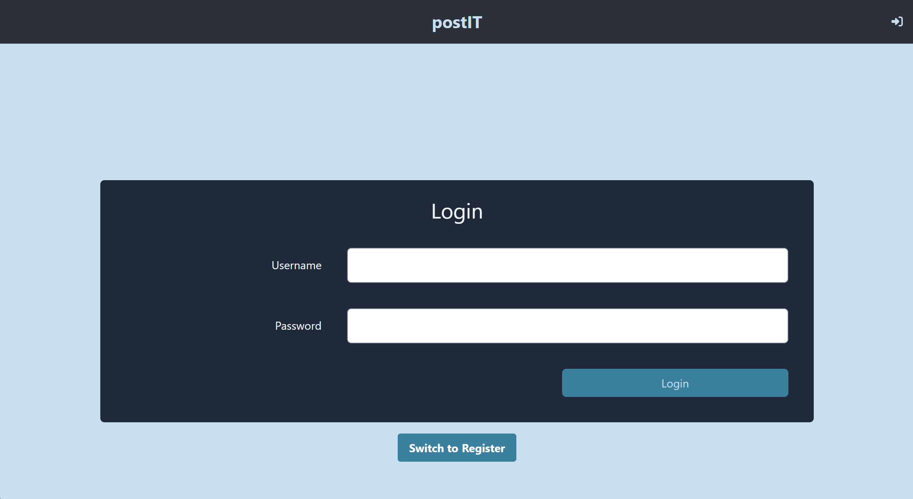
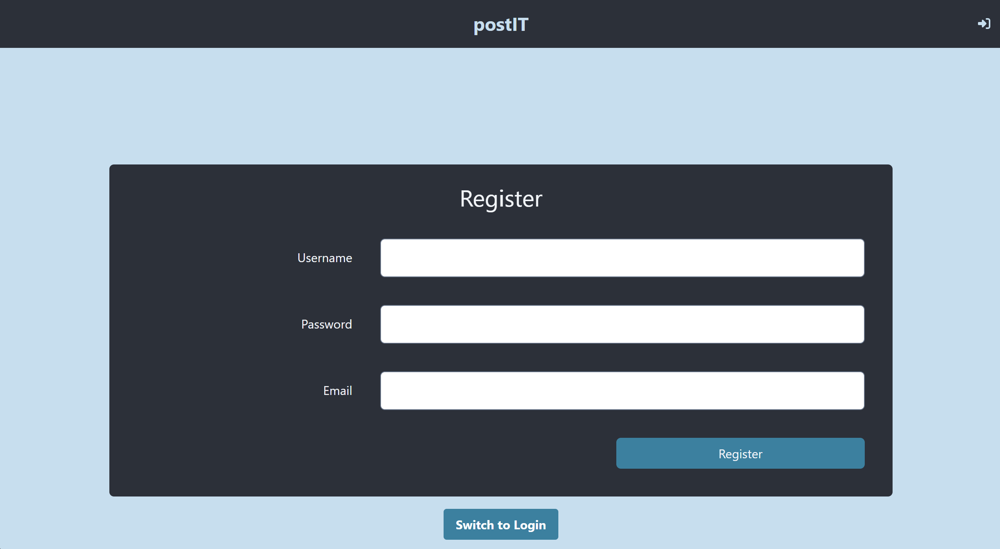
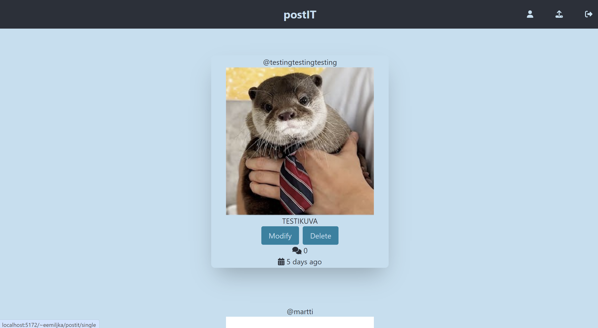
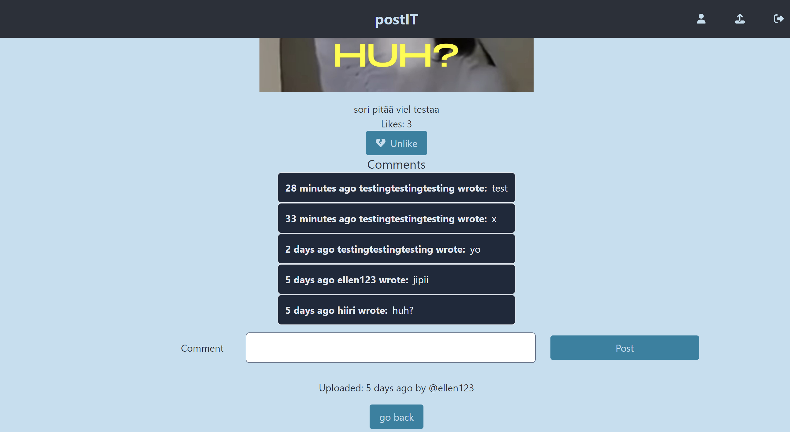
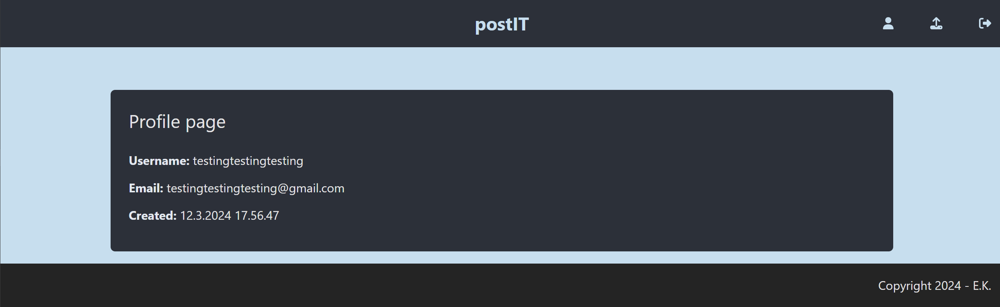
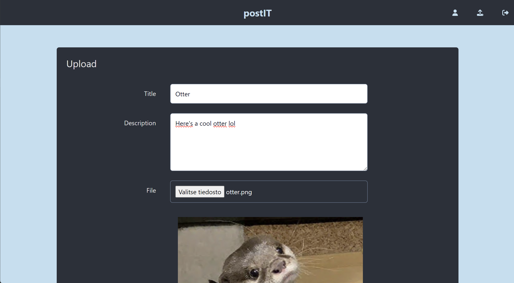
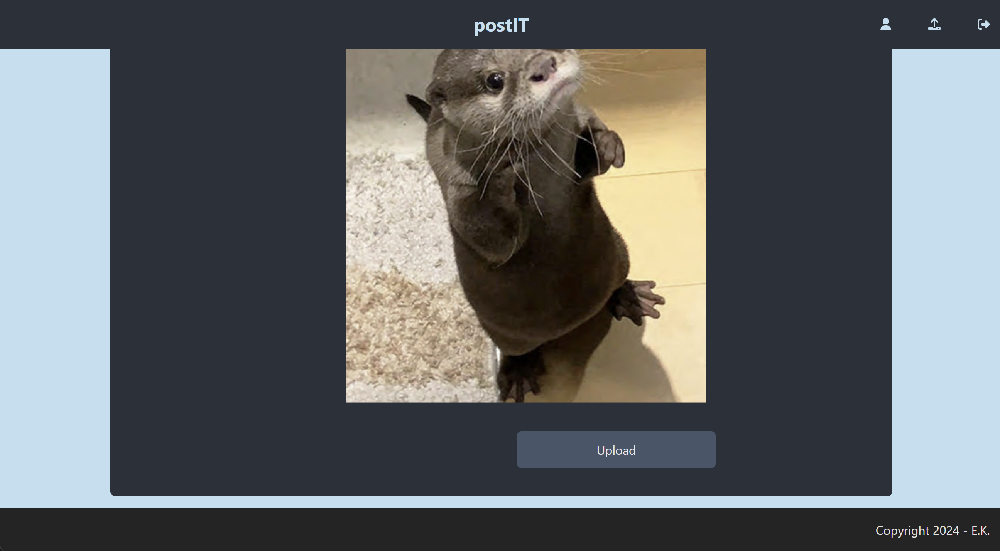

# React app

Open [this link in browser](https://users.metropolia.fi/~eemiljka/postit/) to see the app in action.

# SCREENSHOTS

## Home screen (not logged in)

## Login

## Register

## Home screen logged in seeing "your own image" that you can "delete". (Modify does not work)

## Single view

## Profile

## Upload

## Upload 2

# Functionalities

## Registering

User is able to make a user by filling a form.

## Logging in

User is able to log in with an existing user by filling a form.

## Uploading

Once logged in, a user can upload an image or video with a "title" and a "description".

## Liking

Once logged in, a user can like posts on the timeline. This will add one count to the "like count".

## Commenting

Once logged in, a user can comment on a post for everyone to see. Everyone will also be able to see how long ago the comment was made.

## Logging out

Once logged in, user can log out.

# Additional features

## Post order

Posts are displayed in order from top to bottom, from latest to oldest.

## Comment order

Comments are displayed in order from top to bottom, from latest to oldest.

## Post upload time

Posts' upload time is displayed in a form of: "... hours ago" or "... days ago" etc...

## Comment creation time

Comments' commenting time is displayed in a form of: "... hours ago" or "... days ago" etc...

# Problems

## Modifying problem

Despite being able to click a "modify" -button on your own post, you can't modify it.

## Button visibility

Despite being logged in, you sometimes have to log in again to see the "modify" and "delete" -buttons on your own post.
